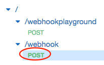
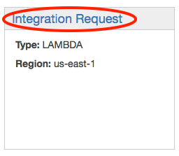
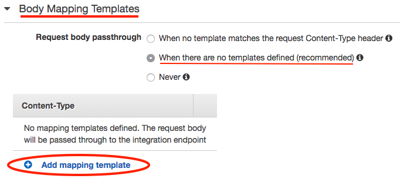
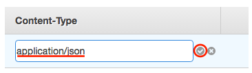
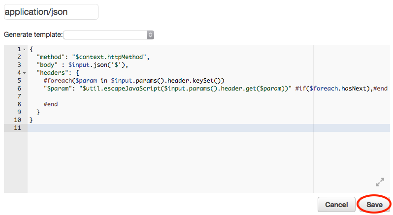

github-hooks-web-service
========================

_Web Service for the github webhooks to hit._

-----------

This Web Service is to contain an AWS lambda, to be exposed through AWS API Gateway. The aim is to configure the
[webhooks](https://developer.github.com/webhooks/) for your organisation so they hit this API with events (containing data). This data is to be
parsed and stored appropriately.


**Tip**: if, at any point, you need to check your API gateway resources try

```shell
aws apigateway get-resources --rest-api-id API_ID
```

You can easily check you API ID through API gateway's UI.

## Configuration

### Amazon AWS

If you haven't installed or configured the AWS CLI yet, please refer to [`web-service`](web-service/README.md) in order to do so. 

All the other steps (regarding setting up the lambda and API gateway) are similar, but we'll detail them here anyway.

#### Role creation

Create a new role for your lambda with the following command:

```shell
aws iam create-role \
    --role-name github-reports-role \
    --assume-role-policy-document file://assets/github-reports-role.json
```

Then, to add the necessary policies to your role, run the following commands:

```shell
aws iam attach-role-policy --role-name github-reports-role --policy-arn arn:aws:iam::aws:policy/service-role/AWSLambdaRole
aws iam attach-role-policy --role-name github-reports-role --policy-arn arn:aws:iam::aws:policy/service-role/AWSLambdaVPCAccessExecutionRole
```

#### Create API

Using the [AWS Web UI](https://console.aws.amazon.com/apigateway) might be an easier way to setup your API, but you can still do it manually
through the AWS CLI.

To create the API with the AWS CLI:

```shell
aws apigateway create-rest-api --name "Github Reports Webhooks API"
```

AWS CLI will return something like:

```json
{
    "name": "Github Reports Webhooks API",
    "id": "API ID",
    "createdDate": 1470319082
}
```

Take note of the ID, as we will use it in the following steps.

Now grab the root of your API with the command:

```shell
aws apigateway get-resources --rest-api-id API_ID
```

The output will be something like:

```json
{
    "items": [
        {
            "path": "/",
            "id": "ROOT ID"
        }
    ]
}
```

Take note of the root path ID as well.

##### Create endpoint mappings

Create `/webhook` endpoint with the following commands:

```shell
aws apigateway create-resource \
    --rest-api-id API ID \
    --parent-id ROOT ID \
    --path-part webhook
```

The output will be something like:

```json
{
    "path": "/webhook",
    "pathPart": "webhook",
    "id": "RESOURCE ID",
    "parentId": "kna1h2rtg4"
}
```

Take note of the resource ID. Now add a POST method to it:

```shell
aws apigateway put-method \
    --rest-api-id API ID \
    --resource-id RESOURCE ID \
    --http-method POST \
    --no-api-key-required \
    --authorization-type NONE
```

You should see something like:

```json
{
    "apiKeyRequired": false,
    "httpMethod": "POST",
    "authorizationType": "NONE"
}
```

We're now ready to bind the endpoint to the proper lambda:

```shell
aws apigateway put-integration \
    --rest-api-id API ID \
    --resource-id RESOURCE ID \
    --http-method POST \
    --type AWS \
    --integration-http-method POST \
    --passthrough-behavior WHEN_NO_TEMPLATES \
    --uri arn:aws:apigateway:AWS_REGION:lambda:path/2015-03-31/functions/arn:aws:lambda:aws-region:YOUR ACCOUNT ID:function:github-reports-webhook-post/invocations
```

A result as the following should come up:

```json
{
    "httpMethod": "POST",
    "passthroughBehavior": "WHEN_NO_TEMPLATES",
    "cacheKeyParameters": [],
    "type": "AWS",
    "uri": "arn:aws:apigateway:us-east-1:lambda:path/2015-03-31/functions/arn:aws:lambda:aws-region:91320918103:function:github-reports-webhook-post/invocations",
    "cacheNamespace": "qrkrjs"
}
```

For more information check the [AWS tutorial](http://docs.aws.amazon.com/lambda/latest/dg/with-on-demand-https-example-configure-event-source.html)
on setting up API gateway with lambda.

#### Method Execution

In order for the responses generated by the AWS Lambda function to work correctly you need to ensure that your method's execution is properly
set up. This can be easily done through API gateway's UI or through the terminal, as we explain here.

The first thing you need to do is to add a method response, so API gateway knows it can be mapped somehow (next step):

```shell
aws apigateway put-method-response \
    --rest-api-id API_ID \
    --resource-id RESOURCE_ID \
    --http-method POST \
    --status-code 200
```

You should see something like:

```json
{
  "statusCode": "200"
}
```

Be sure to add the 500 status code as well:

```shell
aws apigateway put-method-response \
    --rest-api-id API_ID \
    --resource-id RESOURCE_ID \
    --http-method POST \
    --status-code 500
```

We can now move on to configuring the integration responses. The first one we'll be setting up is the 200 OK integration response. By default
we want our responses to be successful, so we'll be adding an integration response with no particular selection pattern:

```shell
aws apigateway put-integration-response \
    --rest-api-id API_ID \
    --resource-id RESOURCE_ID \
    --http-method POST \
    --status-code 200 \
    --selection-pattern -
```

This will make our responses be 200 by default. You should now be looking at something like:

```json
{
    "selectionPattern": "",
    "statusCode": "200"
}
```

Now we need to set up our integration response for when things go south. We do this by providing a regex pattern that matches error messages
 containing "Exception":

```shell
aws apigateway put-integration-response \
    --rest-api-id API_ID \
    --resource-id RESOURCE_ID \
    --http-method POST \
    --status-code 500 \
    --selection-pattern '.*Exception.*'
```

And you should finally see:

```json
{
    "selectionPattern": ".*Exception.*",
    "statusCode": "500"
}
```

So far you've configured your API to properly handle outgoing responses. Now you need to set it up so our lambda handler can properly handle 
requests. We'll be moving onto the [API gateway UI](https://console.aws.amazon.com/apigateway/home), taking a step back to reconfigure our 
integration request.

Select your API - it should have the name you gave it earlier, "Github Reports Webhooks API" - and the `POST` method:



You should now be looking at a map of the whole method execution. Select **Integration Request**.



If you've done everything right so far, the _Integration type_ should be **Lambda Function**, referring to the lambda that was set up. A bit
further down a section named **Body Mapping Templates** should be folded. Expand it and make sure the _Request body passthrough_ rule is
**When there are no templates defined** (which should already be selected). Now on to configuring a mapping template for incoming requests.



Press **Add mapping template** and fill out the _Content-Type_ text field with "_application/json_" type.



A new section, for you to type your template in, should be displayed. Copy and paste the following template onto it.

```json
{
  "method": "$context.httpMethod",
  "body" : $input.json('$'),
  "headers": {
    #foreach($param in $input.params().header.keySet())
    "$param": "$util.escapeJavaScript($input.params().header.get($param))" #if($foreach.hasNext),#end
    #end
  }
}
```

Now you just need to press **Save**.



#### Deploy

Use the [API Gateway Web console](https://console.aws.amazon.com/apigateway) to ship your Web Service to
staging/production and take note of the provided base URL as you'll need it to setup your webhooks.

### Github

You can setup the webhooks on an organisation basis or individually, per repository. We'll be covering the organisation scenario here but setting
up webhooks on each repo is similar with the only difference being you'll need to do this for each repo, under the repo settings.

#### Organisation

Under your organisation's settings webhooks section - `https://github.com/organizations/ORGANISATION/settings/hooks` - press the "**Add webhook**"
button.

You should now add your AWS API gateway endpoint in the "**Payload URL**" text box. Pick `application/json` as the content type and select 
individual events in the *"Which events would you like to trigger this webhook?"* section.

Currently we support a limited set of all the events (and not all the actions for each event): 

- Commit comment
- Issue comment
- Issues
- Pull request
- Pull request review comment

##### Security

Given your API gateway is now exposed to the world we need to make sure the Github webhooks play nice with it, as any event that gets POSTed to 
it will be ignored unless we're sure it's coming from Github.

This means you now need to pick a _secret_ and fill out the "**Secret**" text box with it. Github suggests you generate a random string and use it:

```shell
ruby -rsecurerandom -e 'puts SecureRandom.hex(20)'
```

Copy that secret to your clipboard as you'll need it after finishing setting up the webhook.  

The "**Active**" checkbox should be selected by default. Now press the "**Add webhook**" button to finish the process.

You might want to visit this section of your organisation's settings every now and then, as you can easily check the most recent webhook 
deliveries, with details such as the POST request body (the actual event) and the AWS Lambda's response.

Under the "_resources_" dir on this module you should find a "secret.properties.sample". Duplicate that file and remove the ".sample" extension.
Now open the file and paste your secret there, so it reads:

```
SECRET=your_secret
```

Make sure to save the file and you should be set for the last step, which is uploading your lambda.

#### Lambda upload

To upload or update the Lambda on your Amazon AWS account, just run the Gradle task `uploadWebhookLambda` (or `uWL`).
