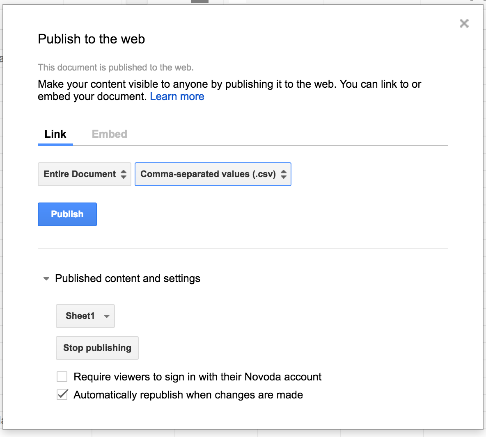

sheets
======

_Facilities to load data from gdocs sheets._

-----------

This module is used to load data from Google docs sheets documents. The data needs to be in a specific format
 for this to work out of the box, if not you're always free to change it as you see fit.
 
Currently we're loading username mappings through gsheets. 

## Document format

Currently we're supporting username mappings only - Float names to Github usernames. This means the document is expected
 to contain two columns, the first being the Float name and the second the corresponding Github username. The first
 row is ignored on both columns.

| Float name | Github username |
| --- | --- |
| Fernando Pessoa | fpessoa |
| Carlos Paredes | cparedes |

## Configuration

### Document

You first need to create a Google sheets document with whatever name you like. Be sure to setup the sharing settings properly:

 - Click on the `Share` button, on the top right corner of the document
  
  
  
 - Make sure `Anyone with the link can view` is selected
 - and copy the URL below
 
  

 - extract the document ID from the URL you've just copied and keep it
 
 `https://docs.google.com/spreadsheets/d/DOCUMENT_ID_HERE/edit?usp=sharing`
 
 - Publish the document, through `File` > `Publish to the web...`
 
 
  
### ID

Now that you've created and published the document, get its ID and place it in the `sheets.credentials` file, which should
be next to `sheets.credentials.sample`. 
