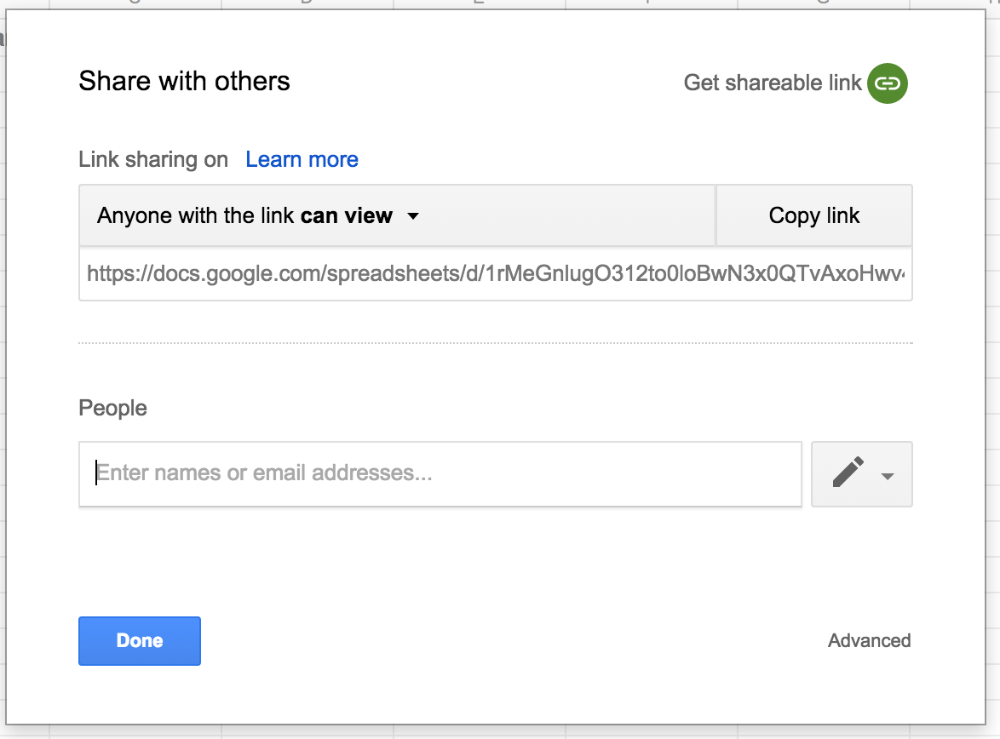

sheets
======

_Facilities to load data from gdocs sheets._

-----------

This module is used to load data from Google docs sheets documents. The data needs to be in a specific format
 for this to work out of the box, if not you're always free to change it as you see fit.
 
Currently we're loading username and project mappings through gsheets. 

## Document format

Currently we're supporting username mappings - Float names to GitHub usernames - and project mappings - Float project names to GitHub repositories.
 This data is contained in two separate documents, one for the username mappings and the other for the projects. Both documents have a similar
 structure:
 
 - The username mappings document is composed of two columns, the first being the Float name and the second the corresponding GitHub username.

| Float name | GitHub username |
| --- | --- |
| Fernando Pessoa | fpessoa |
| Carlos Paredes | cparedes |
| Richard Stallman | richardmstallman |
| Paulo Blundillo | blundillo |

 - The project mappings document is also composed of two columns, the first one being the Float project name and the second one a list of GitHub
 repository names, separated by a comma - ','

 | Float Project name | GitHub Repositories |
 | --- | --- |
 | Stuxnet | stuxnet |
 | Mirai | mirai |
 | Y2K | y2k |
 | Half-life 3 | hl3, source, steam |

On both documents, the first row acts as the header and is ignored when the data is parsed.

## Configuration

### Document

You first need to create the two Google sheets documents with whatever names you want. Be sure to setup the sharing settings properly for both of
 them:

 - Click on the `Share` button, on the top right corner of the document
  
  
  
 - Make sure `Anyone with the link can view` is selected
 - and copy the URL below
 
  

 - extract the document IDs from both the URLs and keep them
 
 `https://docs.google.com/spreadsheets/d/DOCUMENT_ID_HERE/edit?usp=sharing`
 
 - Publish the document, through `File` > `Publish to the web...`
 
 

### ID

Now that you've created and published the documents, get their IDs and place them in the `sheets.credentials` file, which should
be next to `sheets.credentials.sample`. 

```
USERS_DOCUMENT_ID=your_users_document_id
PROJECTS_DOCUMENT_ID=your_projects_document_id
```

You're done!
